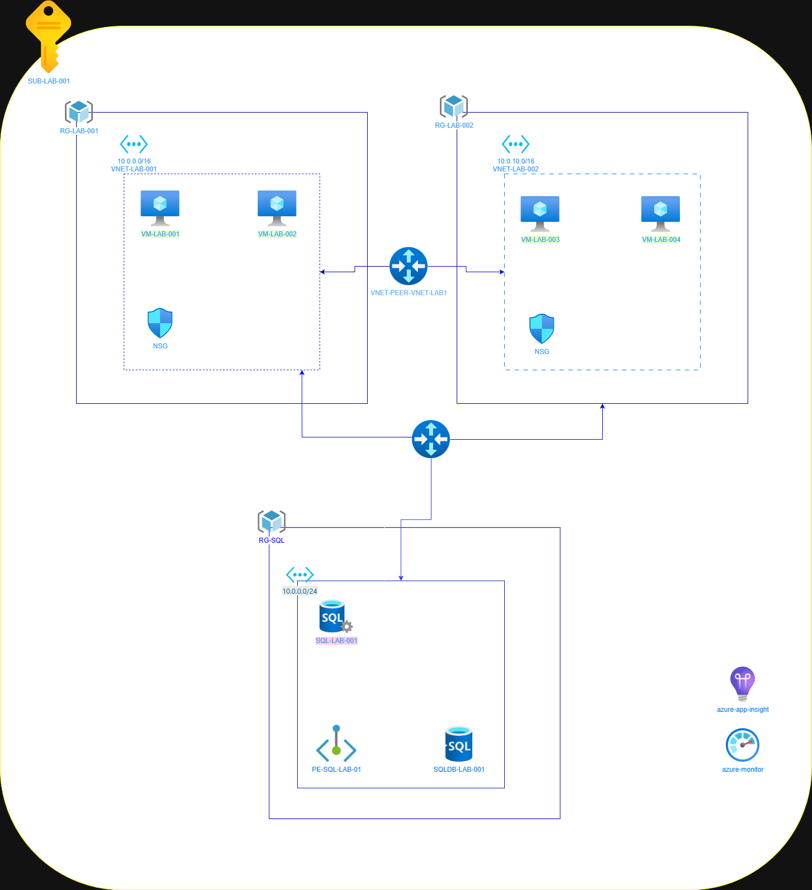

# Azure Infrastructure Lab

This project was created to practice cloud infrastructure concepts using Microsoft Azure.

## Architecture

## Resources created

- Virtual Networks (VNET)
- Subnets
- Network Security Groups (NSG)
- Virtual Machines
- SQL Database
- Resource Groups

## Objective

Practice Azure administration and cloud infrastructure design.

This project is part of my AZ-104 preparation.

## Author

Guilherme de Sales Angelis Oliveira  
Cloud & Infrastructure Junior  

LinkedIn:  
https://www.linkedin.com/in/guilherme-de-sales-angelis-oliveira-8444b92a7/
